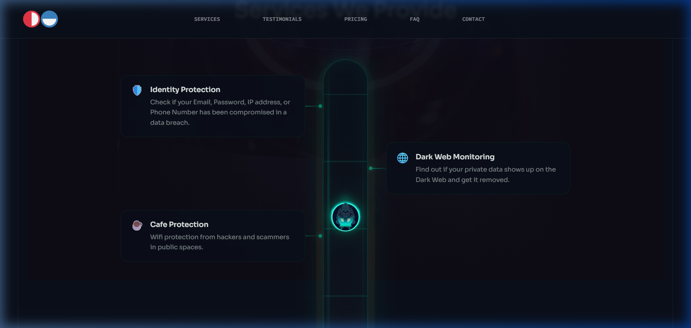

# Data Vigilantes — AR & Digital Visiting Card

An Augmented Reality (WebAR) and 3D Interactive Business Card built for **Data Vigilantes**.



## 🚀 Features

- **Augmented Reality (WebAR)**: Powered by MindAR & Three.js. Scan the physical business card target (`DV-front-side-card.png`) to reveal interactive 3D profile hologram, animated preview, and contact links directly anchored in 3D space.
- **3D Digital Card**: Accessible directly via browser with interactive 3D perspective shifts, holographic borders, contact actions (Phone, Email, LinkedIn, Website), and vCard download.
- **Target Tracking**: Uses pre-compiled MindAR tracking descriptors (`targets.mind`).

## 📁 Key Files

- `ar.html` — The main Augmented Reality experience (camera feed tracking).
- `index.html` — Interactive 3D web business card.
- `card-front.html` — Card front target generator/viewer.
- `targets.mind` — MindAR target compiled file.
- `server.js` — Local development server with CORS, range streaming, and LAN access.

## 💻 Local Development

1. Run the local server:
   ```bash
   node server.js
   ```
2. Open in your browser:
   - AR Experience: `http://localhost:8080/` or `http://localhost:8080/ar.html`
   - 3D Digital Card: `http://localhost:8080/index.html`

## 🌐 Deploy on GitHub Pages

1. Go to repository **Settings** → **Pages**.
2. Under **Build and deployment** → **Branch**, select `main` branch and `/ (root)` folder.
3. Click **Save**.
4. Your card will be live at:
   `https://ashusingh0305.github.io/AR-DV-Visiting-Card/ar.html`
